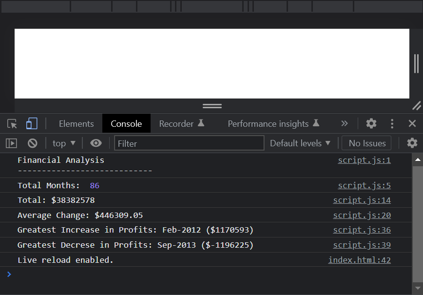

# Console-Finances

> Project that loops through a nested array and logs the necessary information to the console.

## Table of contents

- [General info](#general-info)
- [Screenshots](#screenshots)
- [Technologies](#technologies)
- [Setup](#setup)
- [Live Application](#live-application)
- [Features](#features)
- [Status](#status)
- [Contact](#contact)

## General info

A project to practise looping through, sorting and mathematical operators on arrays then returning the data to the console.

## Screenshots

## Technologies

- HTML
- JavaScript

## Setup

- Open the index.html in any modern browser
- Open the developer tools to view the console (Ctrl + Shift + I on Windows, Cmd + Option + C on Mac)

## Live Application

https://sbillsborough.github.io/Console-Finances/

## Features

- for loops / nested for loops
- string concatenation
- sort()
- Mathematical Operators

## Status

Project is: _finished_

## Contact

Created by [billsboroughscott@gmail.com] - feel free to contact me!
